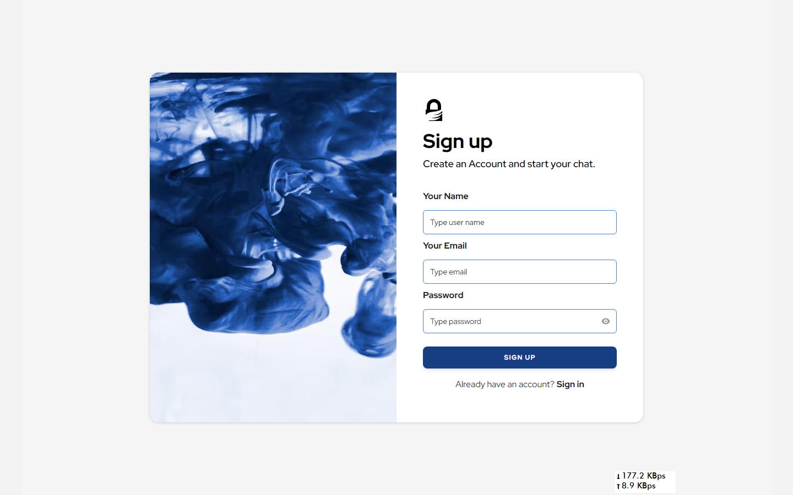

# Chat App

A real-time chat application built using React.js and Firebase with Ant Design (AntD) and Material-UI (MUI) for a rich user interface.

## Table of Contents

- [Features](#features)
- [Technologies Used](#technologies-used)
- [Setup](#setup)
- [Usage](#usage)
- [Contributing](#contributing)
- [License](#license)
- [Contact](#contact)

## Features

- Real-time messaging
- User authentication and authorization
- Customizable UI themes
- Responsive design
- Integration with AntD and MUI for enhanced UI components
- Secure data management with Firebase

## Technologies Used

- **React.js**: JavaScript library for building user interfaces.
- **Firebase**: Backend-as-a-Service providing real-time database and authentication.
- **Ant Design (AntD)**: React UI library for fast and easy web development.
- **Material-UI (MUI)**: Popular React UI framework.

### Snapshots

Signup-login Page


Chat Page


## Setup

### Prerequisites

- Node.js and npm installed on your local machine.
- A Firebase project with Firestore and Authentication enabled.

### Installation

1. Clone the repository:

   ```bash
   git clone https://github.com/yourusername/chat-app.git
   ```

2. `npm install`

3. Configure Firebase:

- Create a .env file in the root directory of the project.
- Add your Firebase configuration details to the .env file

```
REACT_APP_FIREBASE_API_KEY=your_api_key
REACT_APP_FIREBASE_AUTH_DOMAIN=your_auth_domain
REACT_APP_FIREBASE_PROJECT_ID=your_project_id
REACT_APP_FIREBASE_STORAGE_BUCKET=your_storage_bucket
REACT_APP_FIREBASE_MESSAGING_SENDER_ID=your_messaging_sender_id
REACT_APP_FIREBASE_APP_ID=your_app_id
```

### Running the App

1. Start the development server
   `npm start
`
2. Open your browser and visit http://localhost:5173.

### Usage

- Register or log in with your email.
- Start a new conversation or join an existing one.
- Enjoy real-time messaging with friends and colleagues.

### Contributing

Contributions are welcome! Please follow these steps to contribute:

1. Fork the repository.
2. Create a new branch for your feature or bug fix.
3. Make your changes and commit them with a clear message.
4. Push your changes to your fork.
5. Submit a pull request.

### Contact

For any questions or suggestions, feel free to reach out me at famuhammmad907@gmail.com.
